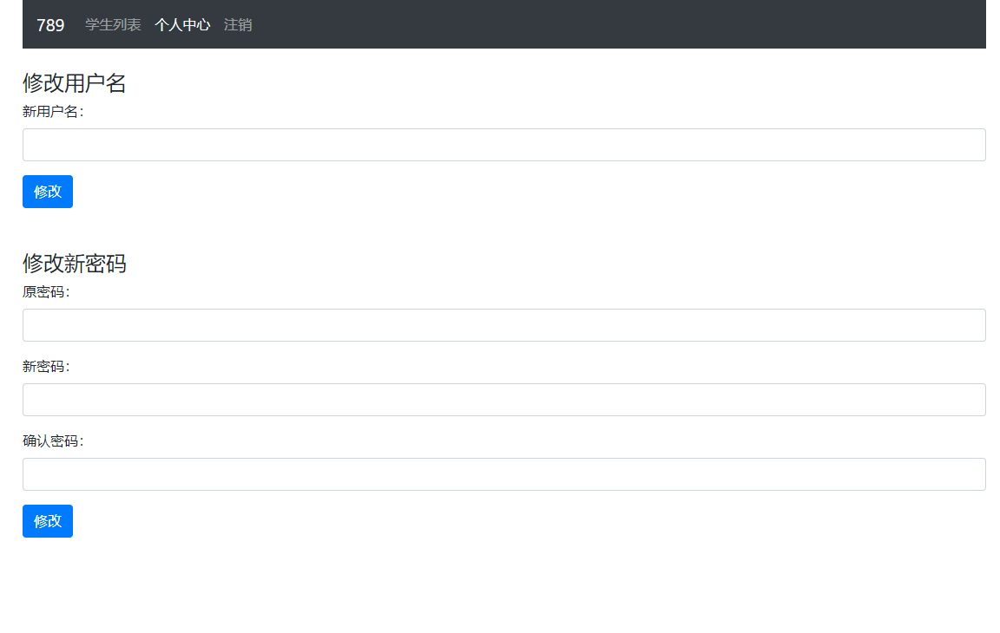

# PHP 学生管理系统

一个使用 PHP 实现，功能简单的学生管理系统，刚好够应付课堂作业用。

背景图片来源：https://www.pixiv.net/artworks/59440693

## 项目截图预览





## 实现功能

- 登录
- 注册
- 修改用户名
- 修改密码
- 使用 cookie 保持登录状态
- 对学生的增删查改

## 技术栈

- PHP
- Bootstrap v4
- MariaDB（与 MySQL 兼容）

## 测试环境

- WampServer Version 3.2.0 64bit
- PHP 5.6.40 for CLI (Command-Line Interface)
- MariaDB 10.4.10

## 数据库创建语句

```SQL
create database student_management;
use student_management;

CREATE TABLE user (
   id int auto_increment primary key,
   uname varchar(20) not null,
   pwd varchar(20) not null
)default charset=utf8;

create table student (
    id int primary key auto_increment,
    sid int not null,
    name varchar(15) not null,
    age int not null,
    sex enum('男', '女', '其他') not null,
    uid int not null,
    FOREIGN KEY(uid) REFERENCES user(id)
)default charset=utf8;
```

## 可以改善的地方

- SQL 语句的生成是通过简单粗暴地拼接字符串完成的，最开始是为了方便应付作业的人能够快速上手并完成。正确的做法是对 SQL 语句进行预处理，否则会导致 SQL 注入攻击。
